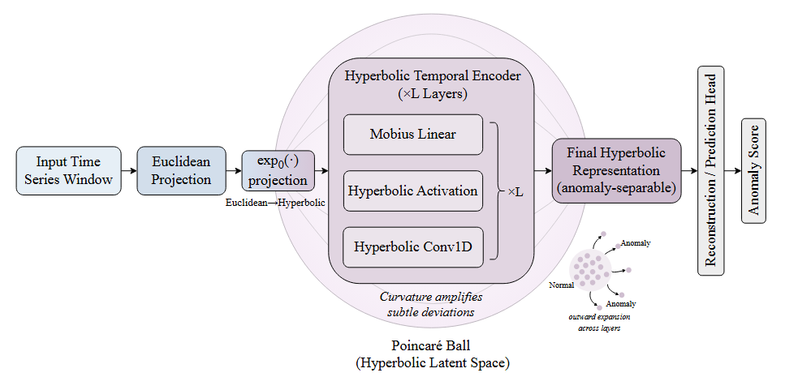

# HyperTS: Identifying Indistinguishable Time-Series Anomalies in Hyperbolic Space

This repository provides the **official implementation** of: **HyperTS: Identifying Indistinguishable Time-Series Anomalies in Hyperbolic Space**

This project is **built upon the TAB repository** (Unified Benchmarking of Time Series Anomaly Detection Methods) and extends it with the proposed HyperTS model and related experimental pipeline.

HyperTS is designed to tackle *indistinguishable anomalies* in time series by modeling data in **hyperbolic space**, improving separability in low-contrast anomaly scenarios and achieving strong performance on challenging benchmarks.



---

## 🚀 Quickstart

> This project is fully tested under **Python 3.8**.

We provide a fully automated script to reproduce the experiments.  
**Just run one command:**

```bash
pip install -r requirements.txt
bash scripts/Hyper.sh
```


## Citation


```
@inproceedings{qiu2025tab,
title      = {{TAB}: Unified Benchmarking of Time Series Anomaly Detection Methods},
author     = {Xiangfei Qiu and Zhe Li and Wanghui Qiu and Shiyan Hu and Lekui Zhou and Xingjian Wu and Zhengyu Li and Chenjuan Guo and Aoying Zhou and Zhenli Sheng and Jilin Hu and Christian S. Jensen and Bin Yang},
booktitle  = {Proc. {VLDB} Endow.},
year       = {2025}
}


@inproceedings{wu2025catch,
title     = {{CATCH}: Channel-Aware multivariate Time Series Anomaly Detection via Frequency Patching},
author    = {Wu, Xingjian and Qiu, Xiangfei and Li, Zhengyu and Wang, Yihang and Hu, Jilin and Guo, Chenjuan and Xiong, Hui and Yang, Bin},
booktitle = {ICLR},
year      = {2025}
}
```

